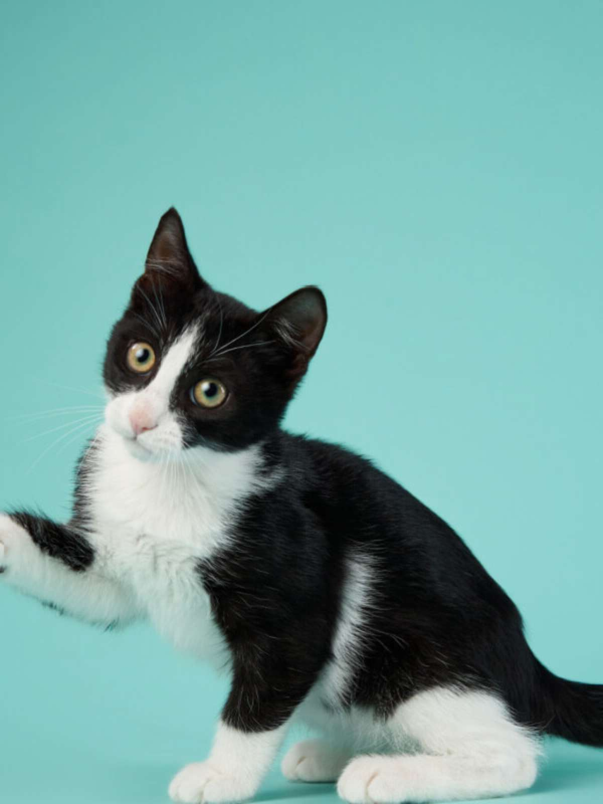

# Projeto de Análise de Imagens com Copilot Bing

## Descrição do Projeto
Este projeto é o resultado final do bootcamp de Inteligência Artificial da DIO em parceria com a Microsoft. O objetivo é utilizar o Copilot Bing para analisar e interpretar imagens, demonstrando a aplicação prática de tecnologias de visão computacional e IA.

## Processo

1. **Coleta de Imagens**: Selecionei uma variedade de imagens para teste, incluindo retratos de humanos, de animais e de objetos do cotidiano.

2. **Configuração do Ambiente**: Utilizei o Copilot Bing através da interface web, garantindo que tinha as permissões necessárias para upload e análise de imagens.

3. **Upload e Análise**: Cada imagem foi enviada individualmente para o Copilot Bing. As respostas foram cuidadosamente registradas.

4. **Documentação**: As análises foram documentadas em arquivos markdown separados na pasta `outputs`.

## Exemplos de Análise

### Imagem 1: Gato

Descrição do Copilot Bing:
"A imagem mostra um gato preto e branco com uma face predominantemente preta, área branca ao redor da boca e do nariz, e olhos grandes e redondos de cor amarela. As orelhas do gato estão apontadas para cima, e seu corpo é visível, com pelo preto nas costas e branco na parte da frente. O gato parece estar em posição sentada, com uma das patas dianteiras ligeiramente levantada, como se estivesse fazendo um gesto. O fundo é de cor azul claro, proporcionando um contraste nítido com o pelo do gato. Não há problemas matemáticos ou de lição de casa presentes nesta imagem para transcrever. 🐾"

[Ver análise completa](outputs/gato.md)

### Imagem 2: Alienígena

Descrição do Copilot Bing:
"A imagem retrata duas mãos formando um coração contra um céu estrelado. A silhueta da cabeça de uma pessoa está posicionada no centro do coração, mas o rosto está obscurecido por uma área retangular borrada. Essa composição pode ser interpretada como uma expressão artística de amor ou afeto, com o céu noturno adicionando um cenário romântico ou tranquilo. 🌟❤️"

[Ver análise completa](outputs/alienigena.md)

### Captura de Tela 1: Exemplo de Prompt para detecção da imagem "Alienígena"

## Insights

1. **Precisão na Detecção de Objetos**: O Copilot Bing demonstrou uma notável capacidade de identificar objetos específicos nas imagens, mesmo em cenas complexas.

2. **Compreensão de Contexto**: Além de identificar elementos individuais, o sistema foi capaz de interpretar o contexto geral das cenas.

3. **Limitações em Cenas Ambíguas**: Observei que em algumas imagens com elementos ambíguos ou abstratos, as interpretações podiam variar.

4. **Limitações por Privacidade**: Observei que em algumas imagens semelhantes a humanos, as interpretações são limitadas por questões éticas e de privacidade.

## Conclusão

Este projeto demonstrou o potencial impressionante das tecnologias de IA na análise e interpretação de imagens. A experiência adquirida neste bootcamp abriu meus olhos para as inúmeras aplicações práticas destas tecnologias em diversos campos.